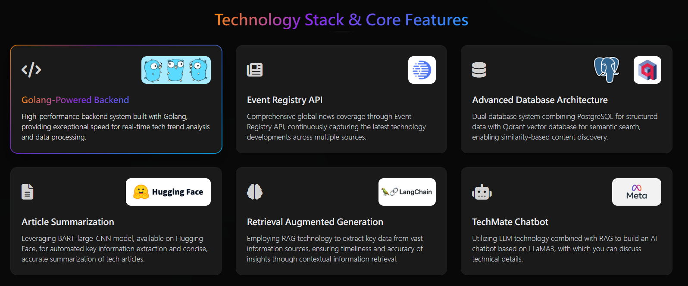

*<h1 align="center"> 🚀 Tech RAG </h1>*

Leverage **Large Language Models (LLMs)** and **Retrieval-Augmented Generation (RAG)** techniques to build an intelligent platform that fetches and answers queries about the latest technology news.

---

**Demo Video:** [YouTube](https://youtu.be/GjZI6MO7e0w)

---

## 📚 Tech Stack

- **Backend**:
  
  
- **RAG Engine**:
  
  
  
- **Database**:
  
  
- **Chatbot Model**:
  
- **News Source**:
  

## 🎯 Future Features

- **Search and filtering capabilities**
- **Enhanced RAG functionality and performance**
- **Automated news fetching pipeline**